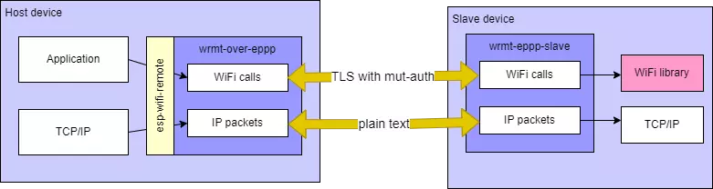

# WiFi Remote over EPPP

EPPP-based backend implementation for `esp_wifi_remote`, providing encrypted WiFi connectivity through PPP link with SSL/TLS authentication.

## Overview

This component implements the backend communication layer for `esp_wifi_remote` using the [eppp-link](https://github.com/espressif/esp-protocols/tree/master/components/eppp_link) component. It creates a secure point-to-point connection between host and slave devices, enabling WiFi functionality on non-WiFi ESP chipsets.

## Key Features

- **SSL/TLS Encryption**: Mutual authentication for secure communication of WiFi commands and events
- **PPP Protocol**: Standard point-to-point protocol with IP address assignment to both devices
- **Network Address Translation**: Slave device routes host packets to WiFi network
- **Cross-Platform Compatibility**: Works with non-ESP32 targets using standard PPP protocols

## Architecture

**Communication Channels:**
- **Control Path**: SSL/TLS encrypted connection for WiFi API calls and events
- **Data Path**: Plain text peer-to-peer connection using IP packets

**Network Stack:**
- Both host and slave devices run full TCP/IP stacks
- Host device operates behind NAT (slave-side network address translation)
- Ethernet frames can be enabled for improved performance when NAT limitations are acceptable

## Performance

- **Maximum TCP Throughput**: ~20Mbps
- **Use Case**: Applications requiring encrypted host-slave communication
- **Trade-offs**: NAT limitations may affect external network visibility

## Use Cases

Ideal for scenarios requiring:
- **Encrypted Communication**: Especially when transmitting WiFi credentials
- **Standard Protocols**: Integration with `pppd` on Linux systems
- **Non-ESP32 Targets**: Cross-platform compatibility with standard networking protocols
- **Security-Conscious Applications**: Mutual SSL/TLS authentication requirements

## Configuration

Configure through `esp_wifi_remote` component with `wifi_remote_over_eppp` selected as backend. WiFi settings use `WIFI_RMT_` prefix instead of `ESP_WIFI_`.

> **Note**: Some configuration options are compile-time only. Ensure slave-side configuration matches host settings.

## Dependencies

- [`esp_wifi_remote`](https://github.com/espressif/esp-wifi-remote/tree/main/components/esp_wifi_remote)
- [`eppp-link`](https://github.com/espressif/esp-protocols/tree/master/components/eppp_link)

:warning: **Important**: This component should only be used with `esp_wifi_remote`. It provides alternative implementations of `esp_wifi_remote` functions with no public API of its own.
